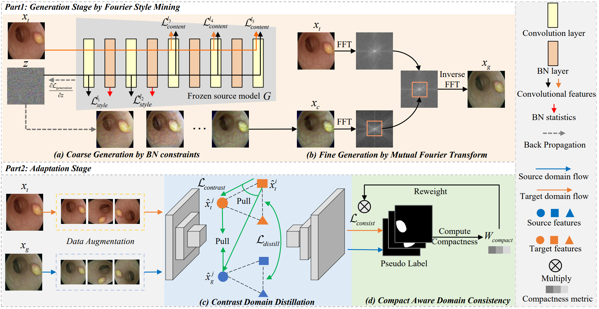

<!-- # Source free domain adaptation for medical image segmentation with fourier style mining

# Overview
Unsupervised domain adaptation (UDA) aims to exploit the knowledge learned from a labeled source dataset to solve similar tasks in a new unlabeled target domain. Existing UDA techniques typically assume that samples from source and target domains are freely accessible during the training. However, it may be impractical to access source images due to privacy concerns, especially in medical imaging scenarios with the patient information. To tackle this issue, we devise a novel source free domain adaptation framework with fourier style mining, where only a well-trained source segmentation model is available for the adaptation to the target domain. Our framework is composed of two stages: a generation stage and an adaptation stage. In the generation stage, we design a Fourier Style Mining (FSM) generator to inverse source-like images through statistic information of the pretrained source model and mutual Fourier Transform. These generated source-like images can provide source data distribution and benefit the domain alignment. In the adaptation stage, we design a Contrastive Domain Distillation (CDD) module to achieve feature-level adaptation, including a domain distillation loss to transfer relation knowledge and a domain contrastive loss to narrow down the domain gap by a self-supervised paradigm. Besides, a Compact-Aware Domain Consistency (CADC) module is proposed to enhance consistency learning by filtering out noisy pseudo labels with shape compactness metric, thus achieving output-level adaptation. Extensive experiments on cross-device and cross-centre datasets are conducted for polyp and prostate segmentation, and our method delivers impressive performance compared with state-of-the-art domain adaptation methods.

# Installation

# Getting Started -->

# Source Free Domain Adaptation for Medical Image Segmentation with Fourier Style Mining (MIA 2022)

This is the official PyTorch implementation of **FSM** (Fourier Style Mining) (MIA 2022).

**Source Free Domain Adaptation for Medical Image Segmentation with Fourier Style Mining**[\[Paper\]](https://www.sciencedirect.com/science/article/pii/S1361841522001049)

Chen Yang, Xiaoqing Guo, Zhen Chen, Yixuan Yuan

<div align="center">
  
</div>

# Get Started

## Environment

Install dependencies
```
pip install -r requirements.txt
```

## Datasets Preparation

### EndoScene and ETIS-Larib
(1) Download the [EndoScene and ETIS-Larib](https://drive.google.com/drive/folders/1HqlgeYwqeh538lSmrAapCL2GP0zvUUH_?usp=sharing) dataset.

(2) Put the data in the corresponding folders.
The dataset files are organized as follows.
```
SFDA-FSM
├── data
│   ├── EndoScene
│   │   ├── images
│   │   │   ├── [case_id].png
│   │   ├── labels
│   │   │   ├── [case_id].png
│   ├── ETIS-Larib
│   │   ├── images
│   │   │   ├── [case_id].png
│   │   ├── labels
│   │   │   ├── [case_id].png

```

(3) Split dataset into training set and test set as follows.

```
python preprocess.py
```
## Training

### Generation Stage
(1) Generate source-like images as follows.

```
python tools/domain_inversion.py 
```
(2) Visualization of source-like images.

### Adaptation Stage
```
python tools/train_adapt.py 
```

## Testing
```
python tools/test.py 
```

# Citation
If you find this project useful, please consider citing:

```
@article{yang2022source,
  title={Source free domain adaptation for medical image segmentation with fourier style mining},
  author={Yang, Chen and Guo, Xiaoqing and Chen, Zhen and Yuan, Yixuan},
  journal={Medical Image Analysis},
  volume={79},
  pages={102457},
  year={2022},
  publisher={Elsevier}
}
```

